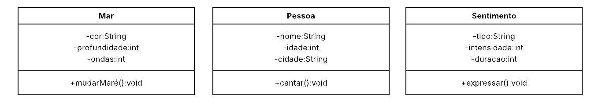

# **2. Música. Escolha uma música de sua preferência. A partir dela, elabore 3 classes, sendo que cada uma deve ter 3 atributos e 1 método. Modele cada classe utilizando diagrama UML (Sugestão: Lucidchart). Importante: Um objeto representante de cada classe deve aparecer na letra da música.**

### Música de referência

<div align="center">
  <h3> Clique na Imagem Abaixo para ser Redirecionado ao Youtube </h1>
<a href="https://www.youtube.com/watch?v=b-X2sam6d68" target="_blank"></a>
</div>

## Atividade 2 UML
<div align="center">
  
</div>

## Arquivo ``Main``
```java
public class Main {
    public static void main(String[] args) {
        Mar mar = new Mar("azul", 5, 10);
        mar.mudarMare();

        Pessoa joao = new Pessoa("João", 20, "Caçapava");
        joao.cantar();

        Sentimento apreciar = new Sentimento ("apreciação", 10, 60);
        apreciar.expressar();
    }
}
```
## Classe ``Mar``
```java
public class Mar {
    private String cor;
    private int profundidade;
    private int ondas;

    public Mar(String cor, int profundidade, int ondas) {
        this.cor = cor;
        this.profundidade = profundidade;
        this.ondas = ondas;
    }

    public void mudarMare() {
        System.out.println("O mar mudou sua maré e agora está mais calmo.");
    }
}
```
## Classe ``Pessoa``
```java
public class Pessoa {
    private String nome;
    private int idade;
    private String cidade;

    public Pessoa(String nome, int idade, String cidade) {
        this.nome = nome;
        this.idade = idade;
        this.cidade = cidade;
    }
    public void cantar(){
            System.out.println(nome + " está cantando sobre o mar.");
    }
}
```
## Classe ``Sentimento``
```java
public class Sentimento {
    private String tipo;
    private int intensidade;
    private int duracao;

    public Sentimento(String tipo, int intensidade, int duracao) {
        this.tipo = tipo;
        this.intensidade = intensidade;
        this.duracao = duracao;
    }

    public void expressar(){
        System.out.println("O sentimento de "+ tipo + " está sendo expresso.");
    }
}
```
