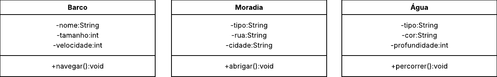

# **3. Imagem. Consulte o link: <a href="https://www.culturagenial.com/vik-muniz-obras/">Obras do Vik Muniz.</a> Selecione duas criações do artista Vik Muniz e para cada uma, elabore 3 classes, sendo que cada uma deve ter 3 atributos e 1 método. Modele cada classe utilizando diagrama UML (Sugestão: Lucidchart). Importante: Um objeto representante de cada classe deve ser visualizado na obra.**

## Lampedusa 
<div align="center">
  
</div>

## Lampedusa
### Arquivo ``main``
```java
public class Main {
    public static void main(String[] args) {
        Barco barco = new Barco("Esperança", 30, 20);
        Localidade porto = new Localidade("Porto","Rua das Ondas", "Lampedusa");
        Agua agua = new Agua("Salgada", "Azul", 200);

        barco.navegar(porto);
        porto.abrigar(barco, porto);
        agua.percorrer(porto);
    }
}
```
### Classe ``Barco``
```java

public class Barco {
    private String nome;
    private int tamanho;
    private int velocidade;

    public Barco(String nome, int tamanho, int velocidade) {
        this.nome = nome;
        this.tamanho = tamanho;
        this.velocidade = velocidade;
    }

    public void navegar(Localidade destino) {
        System.out.println("O " + nome + " está indo até " + destino.getCidade());
    }

    public String getNome() {
        return nome;
    }
}

```
### Classe ``Localidade``
```java
public class Localidade {
    private String tipo;
    private String rua;
    private String cidade;

    public Localidade(String tipo, String rua, String cidade) {
        this.tipo = tipo;
        this.rua = rua;
        this.cidade = cidade;
    }

    public void abrigar(Barco barco, Localidade tipo) {
        System.out.println("O " + tipo.getTipo() + " abriga o " + barco.getNome());
    }

    public String getCidade() {
        return cidade;
    }
    public String getTipo() {
        return tipo;
    }
}
```
### Classe ``Agua``
```java
public class Agua {
    private String tipo;
    private String cor;
    private int profundidade;

    public Agua(String tipo, String cor, int profundidade) {
        this.tipo = tipo;
        this.cor = cor;
        this.profundidade = profundidade;
    }

    public void percorrer(Localidade costa) {
        System.out.println("A água percorre por toda a costa de " + costa.getCidade());
    }
}
```
